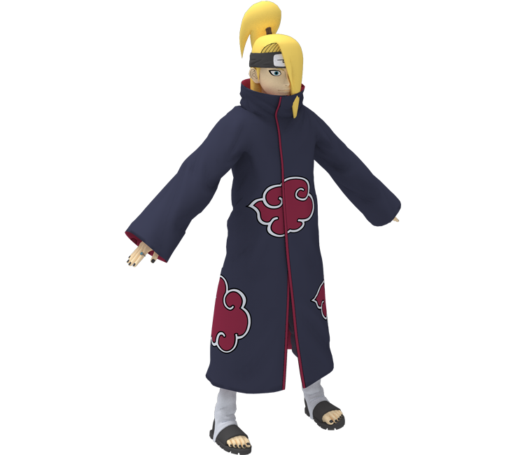
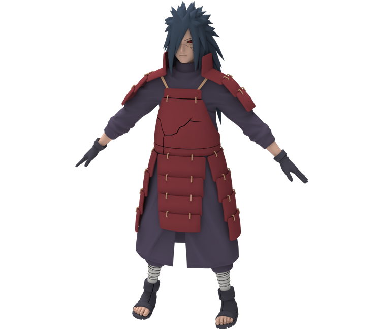
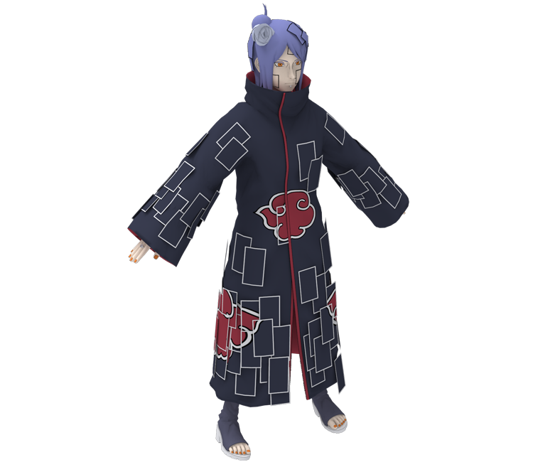

<h1 align=center>SlideShow</h1>
<h2>Sobre o projeto</h2>

Quando estava desenvolvendo um projeto pessoal, vi a necessidade de criar um slideshow, mesmo tendo a facilidade de ferramentas ou frameworks como bootstrap, gostaria de aprofundar meu conhecimento no desenvolvimento em JavaScript, então assim, comecei meus estudos. No projeto em questão, vemos alguns modelos em 3D (<a href="https://www.models-resource.com/">The Models Resource</a>) dos membros da AKATSUKI (Anime: 'Naruto Shippuden'), que pode ser alterado com os botões laterais presentes a cada lado.Acesse o projeto no <a href="https://eduardoagusto.github.io/slideShow_JS_HTML_CSS/">GitHub Sites</a>.

 

<h2>Imagens do Projeto</h2>

<h2>Design</h2>

Em meus projetos gosto de utilizar um design simples e minimalista, mas sem deixar a desejar. Tal design, foi baseado e referenciado em antigos monitores de fórsforo, que quando combinado com corrente eletrica, brilhava verde. Também, cresci assitindo MATRIX...

<h2>Tecnologias utilizadas</h2>

- JavaScript

- HTML5

- CSS3
